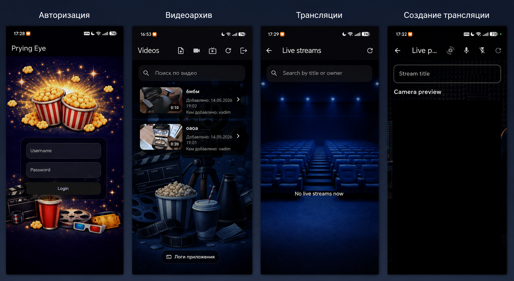

# Flutter Video Platform Client

Mobile client for the Video Platform backend.

The app supports video upload, HLS playback, live streaming, and basic video management.

---

## Screenshots

<p align="center">
  
</p>

---

## Features

### Video

- Video list with search
- Video details screen
- HLS playback
- Quality selection
- Video metadata display:
  - duration
  - upload date
  - author

### Upload

- Pick video file with file_picker
- Create video metadata
- Upload file through upload API
- Poll processing status
- Navigate to playback screen when video is ready

### Live streaming

- Camera capture
- RTMP streaming to backend
- Live session creation
- HLS availability check
- Live stream status tracking

### HLS Player

Custom HLS player based on video_player:

- retry when stream is not ready
- stream-not-ready state handling
- quality switching
- seeking support
- volume control
- immersive mode
- Linux/Web fallback

---

## Architecture

```text
lib/
├── screens/
│   ├── video_list_screen.dart
│   ├── video_detail_screen.dart
│   ├── upload_screen.dart
│   ├── live_screen.dart
│   └── live_lookup_screen.dart
│
├── repositories/
│   ├── auth_repository.dart
│   ├── video_repository.dart
│   ├── upload_repository.dart
│   └── live_repository.dart
│
├── core/
│   └── network/
│
├── widgets/
│   └── hls_player.dart
│
└── config/
    └── app_config.dart
```

---

## Tech stack

- Flutter
- Dio
- video_player
- rtmp_streaming
- file_picker
- permission_handler
- wakelock_plus

---

## Run

```bash
flutter pub get
flutter run
```

---

## Configuration

The backend URLs are configured through dart-define values:

```text
IDENTITY_BASE_URL
VIDEO_BASE_URL
UPLOAD_BASE_URL
LIVE_BASE_URL
ORIGIN_BASE_URL
ENABLE_NETWORK_LOGS
```

Example:

```bash
flutter run \
  --dart-define=IDENTITY_BASE_URL=http://192.168.1.12:8001 \
  --dart-define=VIDEO_BASE_URL=http://192.168.1.12:8003/api/v1 \
  --dart-define=UPLOAD_BASE_URL=http://192.168.1.12:8002/api/v1 \
  --dart-define=LIVE_BASE_URL=http://192.168.1.12:8004 \
  --dart-define=ORIGIN_BASE_URL=http://192.168.1.12:8080
```

---

## Supported platforms

| Platform | Status |
| -------- | ------ |
| Android | Supported |
| iOS | Supported |
| Linux | Fallback for HLS playback |
| Web | Limited support |

---

## Upload flow

```text
createVideo -> initUpload -> uploadFile -> completeUpload -> polling -> ready
```

---

## Live flow

```text
createSession -> RTMP publish -> backend HLS output -> HLS availability check -> live
```

---

## Related project

Backend repository:

<https://github.com/ScriptArchivist/learning>

---

## Status

Active portfolio project.

This app is part of a multi-platform video platform with FastAPI backend, web client, and Flutter mobile client.